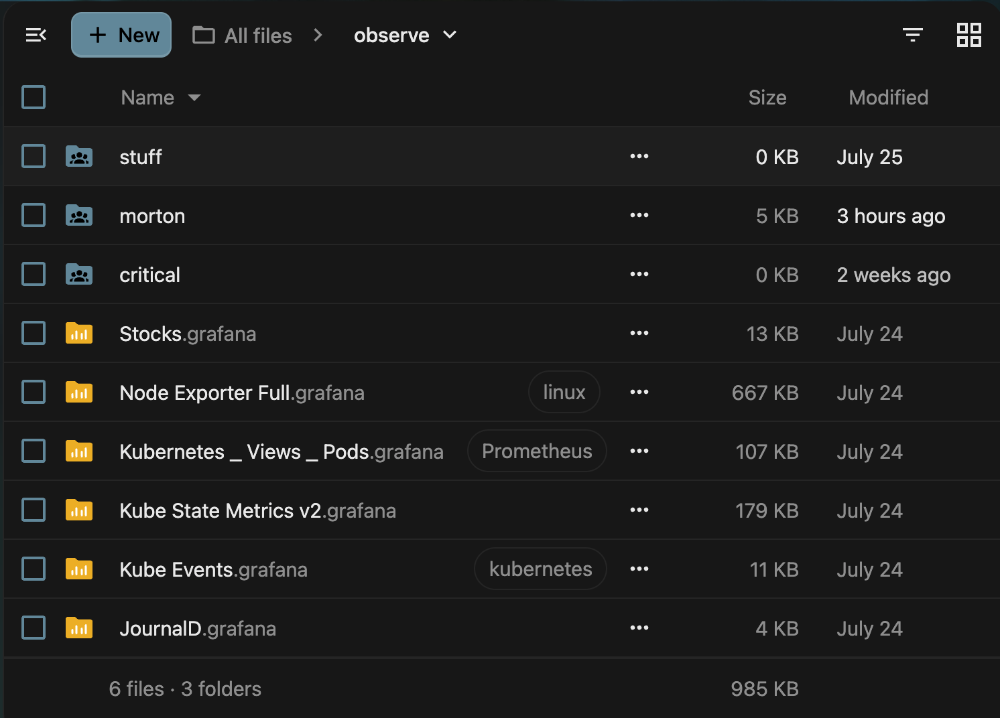
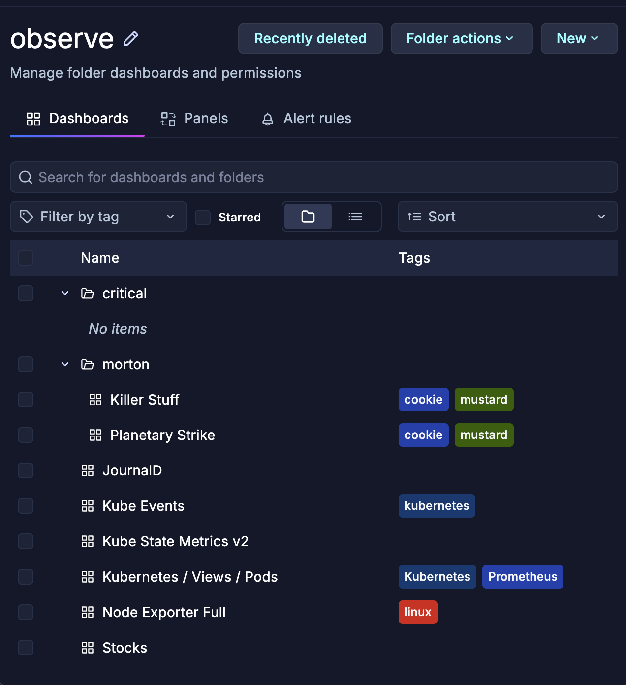
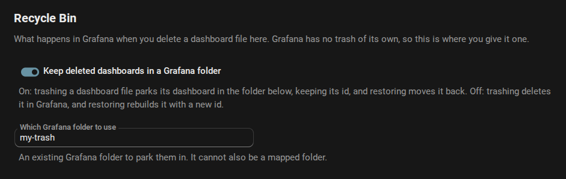
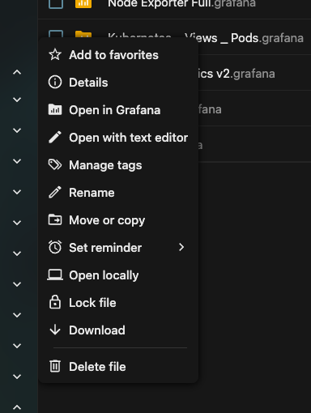
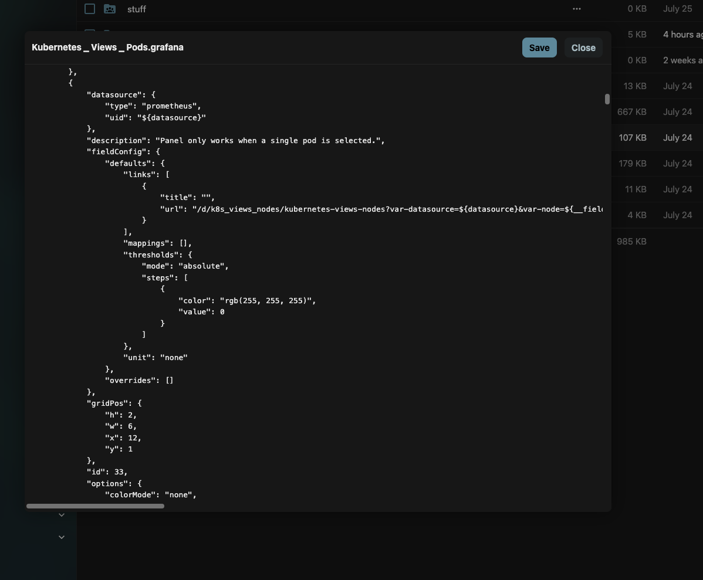
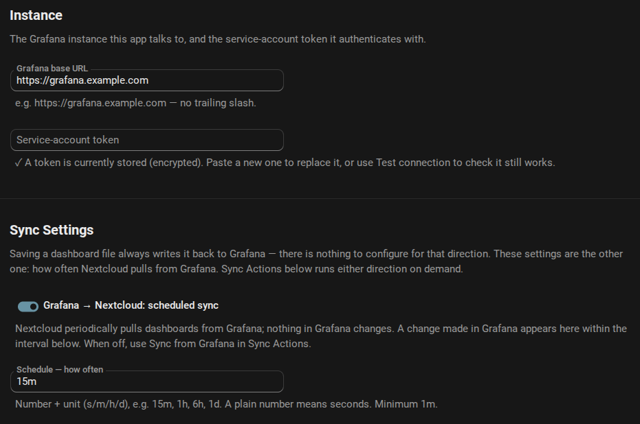
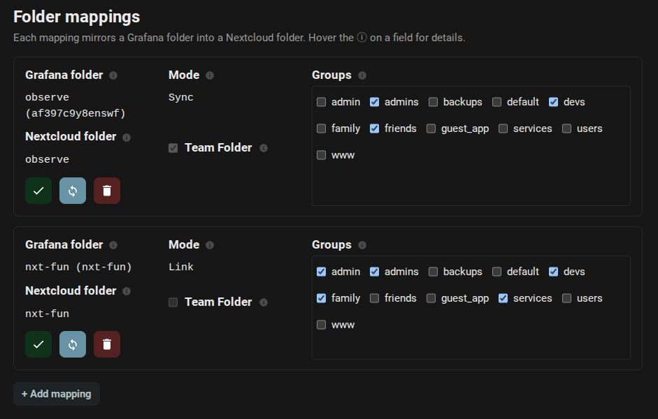
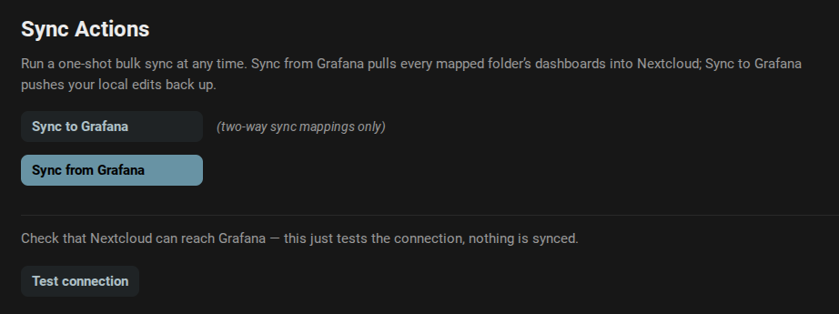

# Grafana Sync

**Your Grafana dashboards, living in Nextcloud as real files.** Browse them, edit them, tag them, file them into folders, trash them, restore them — and every one of those gestures lands in Grafana for real. 📊

[](https://github.com/kubed-io/nextcloud-grafana/actions/workflows/tests.yml)
[](https://github.com/kubed-io/nextcloud-grafana/actions/workflows/quality.yml)
[](https://github.com/kubed-io/nextcloud-grafana/actions/workflows/integration.yml)
[](LICENSE)
[](https://apps.nextcloud.com)
[](composer.json)

---



---

## The whole idea, in one breath

Point the app at your Grafana instance, bind a Grafana **folder** to a Nextcloud **folder**, and everything inside it shows up: subfolders become folders, dashboards become `.grafana` files.

```
Grafana                          Nextcloud
──────────────────────────       ─────────────────────────────
folder   "Observe"          ⟶    Observe/
 ├ dashboard "Fleet Health" ⟶    ├── Fleet Health.grafana
 └ folder    "Region"       ⟶    └── Region/
    └ dashboard "Latency"   ⟶        └── Latency.grafana
```

Edit one in the Files app and Grafana has it seconds later. Rename it in Grafana and the file renames itself. And since Nextcloud is holding the complete dashboard JSON, your mapped folder is quietly also the easiest backup you'll never have to think about. 💾

Nothing is matched on filename. Every file carries its dashboard's **uid**, so renaming, moving, copying, trashing and restoring never break the link — and re-running a sync never duplicates a thing. Ever. 🙅

---

## ✨ Create, read, update, delete — from either side

That's the pitch. Do it in Grafana, do it in Nextcloud, it doesn't matter:

| You do this… | …and this happens |
|---|---|
| Make a `.grafana` file in a mapped folder | A real dashboard appears in Grafana, live |
| Create a dashboard in Grafana | A file appears in the mapped folder |
| Save an edit in Nextcloud | The dashboard is updated in Grafana |
| Edit the dashboard in Grafana | The file's JSON is rewritten to match |
| Rename either one | The filename, the JSON `title`, and Grafana all agree |

Author a dashboard in your editor of choice, over WebDAV, or from the desktop client — it goes live in Grafana without you ever opening the Grafana UI. Make a file *outside* a mapped folder and it stays a plain, untracked document, no strings attached.

📋 [`create.feature`](features/dashboards/create.feature) · ✍️ [`edit.feature`](features/dashboards/edit.feature) · 🔤 [`rename.feature`](features/dashboards/rename.feature)

---

## 🗂️ Real folders, all the way down

This is the part we're smug about. 😏

Grafana has **real, nested folders** — so there is no tagging scheme to maintain and no flat namespace to fake. The mapping is a plain folder-to-folder mirror, and the whole tree comes with it:

```
Observe/                        ← the mapped folder
├── Fleet Health.grafana        → a dashboard at the top
├── Region/                     ← a real Grafana folder 🏷
│   ├── Latency.grafana
│   └── Drafts/                 ← nested as deep as you like
│       └── Sketch.grafana
└── Runbooks/                   ← no dashboards in it, so it stays a plain folder
    └── oncall.md               ← never touched
```

It runs both ways. Make a folder in Grafana and it appears here; make one here and drop a dashboard in, and Grafana has the folder. Move a folder and every dashboard under it is re-parented in one gesture, uids intact — not deleted and re-created to get there. Rename it on either side and the other side follows, because the link is the folder's **uid**, not its name.

A folder holding **no** dashboards stays an ordinary folder, however much else is in it — notes, runbooks, whatever you like. The app claims what it mirrors and nothing else.



*The same folder in Grafana — the one at the top of this page. Same dashboards, same
tags, and `morton` and `critical` are folders on both sides. `Kubernetes / Views /
Pods` is the file called `Kubernetes _ Views _ Pods.grafana`, because a `/` in a
Grafana title cannot be one in a filename. And `stuff` is a Nextcloud folder with no
dashboards in it, so Grafana has never heard of it — the `Runbooks/` rule above,
in the wild.*

🗂️ [`folders/create.feature`](features/folders/create.feature) · 🚚 [`folders/move.feature`](features/folders/move.feature) · 🔤 [`folders/rename.feature`](features/folders/rename.feature)

---

## 🚚 Move it, copy it, duplicate it

A **move** is always *the same dashboard* going somewhere. A **copy** is always *a new one*. Simple rule, and the app is fanatical about it.

- **Move it between folders** — the dashboard is re-parented in Grafana. Same uid, same URL, same history.
- **Move it into another mapping's folder** — it changes hands in one gesture. Nothing is re-created to get there.
- **Move it out of every mapped folder** — the file keeps the full JSON, and the dashboard leaves Grafana. You're holding the only live copy. 📦
- **Copy it** — always a brand-new dashboard with its own uid and its own name. Duplicating a dashboard is now "Ctrl+C, Ctrl+V". 🍝
- **Duplicate it in Grafana** — the copy arrives here as its own file, alongside the original.

**Exactly one file per dashboard, always.** Grafana happily lets three dashboards in one folder share a title; Nextcloud can't. So they arrive as `Fleet Health.grafana`, `Fleet Health (1).grafana` and `Fleet Health (2).grafana` — one file each, all three still titled `Fleet Health` upstream, and no later sync ever shuffles which is which.

🚚 [`dashboards/move.feature`](features/dashboards/move.feature) · 🍝 [`dashboards/copy.feature`](features/dashboards/copy.feature)

---

## 🗑️ Delete, restore, purge — and a recycle bin Grafana never had

**Grafana has no trash.** Delete a dashboard there and it is gone; delete a *folder* there and it takes everything under it with it, in one request, with nothing to undo it. That is the sharpest edge in the whole integration, and this app puts two safety rails in front of it.

The first is Nextcloud's own trash, which you already know. The second is ours:

> **The Grafana recycle bin.** Name any ordinary Grafana folder as the bin and trashing a dashboard file *parks* its dashboard there instead of deleting it — **id kept, URL kept, history kept**. Restore the file and it comes straight back out. Only emptying the Nextcloud trash deletes it for good.

That turns an irreversible cascade into a move, and it is the moment you say you meant it that makes anything permanent.

| Gesture | Bin **off** (default) | Bin **on** |
|---|---|---|
| 🗑️ Move to trash | Dashboard deleted in Grafana now | Dashboard **parked** in the bin, id kept |
| ↩️ Restore from trash | Rebuilt from the file — **new** uid | Moved back out — **same** uid, same URLs |
| 💥 Empty the trash | Nothing left to do | Dashboard permanently deleted |

It works from the Grafana side too, in both directions: purge the parked dashboards in Grafana and the trashed file follows them out of existence; drag them back out of the bin and the trashed folder comes **back**, files and uids intact.

The safety rails you'd hope for are all here. A **link** can't be trashed at all — a pointer is Grafana's to remove, not yours. A purge in Grafana never destroys a file it has never heard of, so the spreadsheet that rode into the trash beside your dashboards is still there. And when the app can't *prove* a dashboard is gone, it leaves your file exactly where it is.



*One toggle and the name of an ordinary Grafana folder. That is the whole safety rail.*

🗑️ [`delete.feature`](features/dashboards/delete.feature) · ↩️ [`restore.feature`](features/dashboards/restore.feature) · 💥 [`purge.feature`](features/dashboards/purge.feature) · 📁 [`folders/delete.feature`](features/folders/delete.feature)

---

## 🏷️ Tags — one set, three surfaces, every direction

Grafana dashboards have tags. Nextcloud files have tags. They are the same tags.

Tag a file in the Files app and the dashboard wears it in Grafana. Tag it in Grafana and it shows up in Nextcloud. Edit the `tags` array in the JSON itself and both agree. **Three surfaces, one set, and any of them can be the one you touched.**

Folders carry tags too, on both sides and to whatever depth your tree goes. And because they're real Nextcloud tags, Nextcloud's own search finds your dashboards by them for free.

🏷️ [`dashboards/tags.feature`](features/dashboards/tags.feature) · 📁 [`folders/tags.feature`](features/folders/tags.feature)

---

## 🎨 A first-class file type — icon, mimetype, honest timestamps

A mirrored dashboard isn't a generic JSON blob. The app registers its own mimetype, so your dashboards wear the **real Grafana icon** instead of a sad little braces glyph.

Then there's the detail we're quietly proud of: **a mirror gets the timestamps of the thing it mirrors.** Grafana's `updated` becomes the file's modification time and `created` its creation time — because "the sync job wrote this file at 15:02" is never the question someone sorting a folder by date is actually asking. A dashboard nobody has touched in a year should *look* like it. 🕰️

The payoff is that Nextcloud's own features just work on your dashboards, for free — recent files, sorting, search, the activity feed.

And every file's state is queryable over WebDAV. A raw `PROPFIND` hands back the dashboard's identity in the XML:

| DAV property | What it holds |
|---|---|
| `nc:metadata-grafana_uid` | The dashboard's uid in Grafana |
| `nc:metadata-grafana_version` | The version the file reflects |
| `nc:metadata-grafana_mode` | `sync`, `reference`¹ or `unmapped` — and it's **indexed** |

Folders carry `nc:metadata-grafana_folder_uid` the same way. All of it is **read-only** — clients can't touch it with `PROPPATCH`; the sync engine owns it. Because `grafana_mode` is indexed, "find every stored archive" is a fast DAV query rather than a folder walk.

¹ `reference` is the on-the-wire value for **link** mode — Nextcloud's PROPFIND treats a stored `link` as a callback and falls over. Everywhere a human looks, it's **link**.

👀 [`dashboards/view.feature`](features/dashboards/view.feature)

---

## 🖱️ Open in Grafana, or pop the hood

Two openers, and you pick per click:

- **Open in Grafana** — the default. Jumps straight to the live dashboard, built from the uid the file already carries, so it keeps working after you rename the file or drag it somewhere else entirely.
- **Open the JSON** — a dashboard *is* its JSON, so the text editor is a real editing surface here, not a curiosity. Change a panel, save, and Grafana has it.

A **link** file only ever opens Grafana. There is nothing on this side to edit.

<table>
<tr>
<td width="40%"></td>
<td width="60%"></td>
</tr>
<tr>
<td><em>Right-click: straight to Grafana, or straight to the JSON.</em></td>
<td><em>Hit <strong>Save</strong> and Grafana has it — panels, datasources, the lot.</em></td>
</tr>
</table>

🖱️ [`dashboards/open-with.feature`](features/dashboards/open-with.feature)

---

## 🧭 Sync or Link — the folder decides

Every mapping is one of two modes, and it applies to every dashboard the mapping pulls. One knob, no per-file overrides to reason about.

| Mode | The file holds | Pushes back? |
|---|---|---|
| 🔁 **Sync** | The full dashboard JSON | **Yes** — fully bidirectional |
| 🔗 **Link** | A tiny pointer (uid, title, URL) | No — clicking it opens Grafana |

**Link** is for dashboards somebody else owns — provisioned by an operator, managed in Git, generated by a chart. Nextcloud treats them as read-only: they can't be edited, trashed, copied or dragged out from this side, and a DAV guard stops anything from overwriting the pointer. A pointer that wandered would be an empty husk that looks like a dashboard and isn't.

There's a third state you don't configure: **unmapped**. That's what a sync file *becomes* when you move it out of its folder — full JSON, keeps its identity, no longer mirrors anything. A portable archive of a dashboard. 📦

🧭 [`mapping/create.feature`](features/mapping/create.feature) · 🗑️ [`mapping/delete.feature`](features/mapping/delete.feature)

---

## 🛠 Setup, in three moves

**1. Point it at Grafana.** Base URL and a service-account token, stored encrypted and never echoed back. That is the whole connection.



**2. Map a folder to a folder.** Pick the Grafana folder from a live picker, name the Nextcloud folder, choose the mode, and pick which groups get to see it. Backed by a Team Folder or an admin-owned shared folder, your call. The subfolders come along automatically — there is nothing per-folder to configure and nothing that can drift from what Grafana actually contains.



**3. Sync it.** Scheduled pulls on whatever interval you like, plus one-shot **Sync from Grafana** and **Sync to Grafana** buttons whenever you're impatient — and "Test connection" so you're never guessing whether it works.



🔌 [`connection.feature`](features/connection/connection.feature) · 🗂️ [`mapping/create.feature`](features/mapping/create.feature) · 🔄 [`sync-now.feature`](features/connection/sync-now.feature)

---

## ⌨️ Every button is also a command

The whole setup is scriptable, so a Kubernetes init job can stand the thing up with no clicking. Exit `0` on success, non-zero on failure.

```sh
# Connect
occ config:app:set grafana_sync grafana_url --value="https://grafana.example.com"
echo "$GRAFANA_TOKEN" | occ grafana_sync:set-token      # stdin keeps it out of your history
occ grafana_sync:test-connection

# Map a Grafana folder to a Nextcloud folder
occ grafana_sync:add-mapping '{"grafana_folder_uid":"af397c9y8enswf","grafana_folder_title":"observe","nc_folder":"Observe","mode":"sync","nc_groups":["ops"],"use_team_folder":true}'
occ grafana_sync:list-mappings
occ grafana_sync:set-groups <mapping-id> ops,admins
occ grafana_sync:remove-mapping <mapping-id>

# Sync — either direction, one mapping or all of them
occ grafana_sync:sync pull --mapping=<mapping-id>
occ grafana_sync:sync push --mapping=<mapping-id>
occ grafana_sync:sync pull
```

---

## 📋 The specs are the docs

Every feature above links to an **executable specification** — a Gherkin `.feature` file under [`features/`](features/) written in plain language, which also *drives the integration tests* against a real Nextcloud and a real Grafana. They're written before the code and kept true after it: a scenario counts as done only once CI has run it green. 🧪

Read [`features/README.md`](features/README.md) for how they're organised.

---

## 📜 Licence & trademark

AGPL-3.0-or-later. See [LICENSE](LICENSE).

This is a community integration and is not affiliated with, endorsed by, or sponsored by Grafana Labs. "Grafana" and the Grafana logo are trademarks of Grafana Labs, used here only to identify the service this app integrates with.
